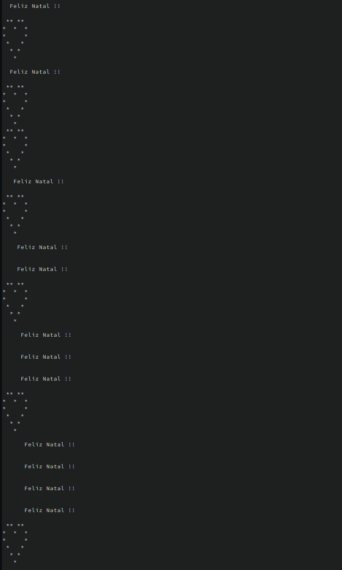

# Design pattern Decorators

## Enunciado

crie um protótipo de gerador de cartões de Natal customizados. Cada cartão de Natal é descrito por uma mensagem básica e
uma variedade (pelo menos 3) de outras mensagens adicionais (decoradores)
que podem ser compostas de maneiras variedades para produzir a mensagem final. Imprima a execução do seu programa
produzindo pelo menos 5 cartões
(mensagens) diferentes por meio da configuração adequada de decoradores.

## como executar a aplicação

```shell
./gradlew run   
```

## Saída esperada

